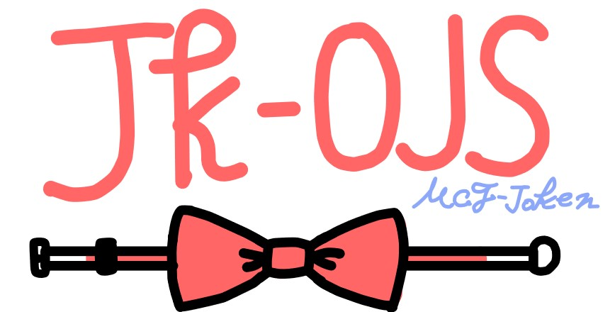

# JK-OJS

(Illustration by T.Yamamoto)  

競技プログラミング向けオンラインジャッジシステム, JK-OJSのスコアサーバーのバックエンドです.

## JK-OJSとは
- JK-OJSは2022年10月に計画が立ち上がったプロジェクトです.
    - 元々はコンフェス2022(中国地区高専コンピューターフェスティバル2022＠松江高専)のために,`KOJSv3`という名前で開発されていました.
    - Golang(Worker/Manager) + TypeScript(Backend) + Vanilla JS(Frontend)で書かれたシステムで,[laminne](https://github.com/laminne)が開発しました.
    - しかし,実装に難(フロントエンドの拡張性が無い,バックエンドがハードコーディングだらけ など)があり,22年5月以降は開発が止まりました.
- JK-OJSは,これまでのKOJSで実装されていなかった機能(e.g: テスト実行)を実装し,新しい機能やUXの向上などを目的として開発されています.

### JK-OJSの"JK"とは?
はっきりとした**名前の由来はありません**が,語源の説はこういう感じです.
- "J"o-"K"en(情研)
- ~~"JK"(女子高生)~~
- Jo-ho Ko-gaku(情報工学)
- JK-FF(論理回路の一種,計画が立ち上がったあたりの授業でやってました)から借用
- Joken "K" OJS (情研による"K"OJSの実装の意)

## Usage
### Requirements
JK-OJS Backendを動作させるには,以下のソフトウェアが必要です.
- git
- pnpm
- nodejs

### Config
*WIP*

## Author
Original Author: Copyright (C) 2021-2023 Tatsuto YAMAMOTO  
JK-OJS Author(s): Copyright (C) 2022-2023 松江高専情報科学研究部

## License
MIT
